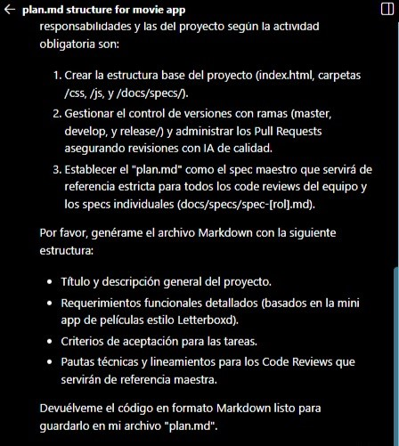
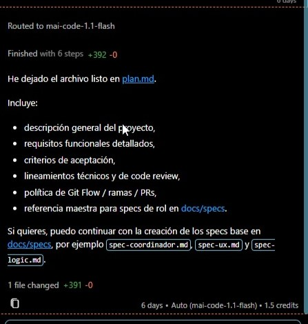

# Prompt 1: Generación del Plan Maestro (plan.md)

- **Rol:** Coordinador / DevOps (@keviineze)
- **Modelo de IA utilizado:** GitHub Copilot (Modo Agente Automático / Workspace)
- **Método / Técnica:** Zero-Shot (instrucción directa sin ejemplos previos).
- **Contexto Proveído:** Se le indicó a la IA las responsabilidades específicas del rol, la necesidad de usar SDD (Spec-Driven Development) y el contexto temático del proyecto (una mini app de películas estilo Letterboxd).

## Prompt Exacto

> "responsabilidades y las del proyecto según la actividad obligatoria son: 
>
>Crear la estructura base del proyecto (index.html, carpetas /css, /js, y /docs/specs/).
>
>Gestionar el control de versiones con ramas (master, develop, y release/) y administrar los Pull Requests asegurando revisiones con IA de calidad.
>
>Establecer el 'plan.md' como el spec maestro que servirá de referencia estricta para todos los code reviews del equipo y los specs individuales (docs/specs/spec-[rol].md).
>
>Por favor, genérame el archivo Markdown con la siguiente estructura:
>
>Título y descripción general del proyecto.
>
>Requerimientos funcionales detallados (basados en la mini app de películas estilo Letterboxd).
>
>Criterios de aceptación para las tareas.
>
>Pautas técnicas y lineamientos para los Code Reviews que servirán de referencia maestra.
>
>Devuélveme el código en formato Markdown listo para guardarlo en mi archivo "plan.md"."

📸 **Captura de pantalla**

## Resultado Esperado

Se buscaba que la IA redactara y estructurara un archivo plan.md completo que funcionara como la "columna vertebral" del proyecto, detallando los requerimientos de la app de películas y las reglas de revisión del equipo.

## Resultado Obtenido

La IA generó exitosamente el contenido y lo inyectó directamente en el archivo plan.md. El resultado incluyó todas las viñetas solicitadas (descripción, requisitos, criterios de aceptación, lineamientos técnicos y la referencia para specs de rol).

📸 **Captura de pantalla**

## Correcciones Manuales

Inicialmente la IA generó las referencias a las rutas de documentación como docs/specs/. Posteriormente, se tuvo que realizar una corrección manual en el archivo para unificar esta ruta hacia la convención oficial del repositorio: docs/03-specs/actividad-obligatoria-1/.

## Archivo o parte del proyecto donde se aplicó

Se aplicó para la creación inicial del archivo maestro plan.md ubicado en la raíz del repositorio.