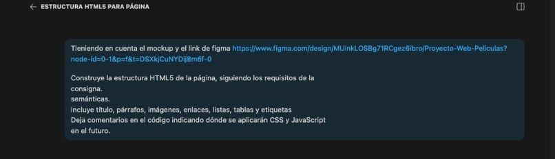
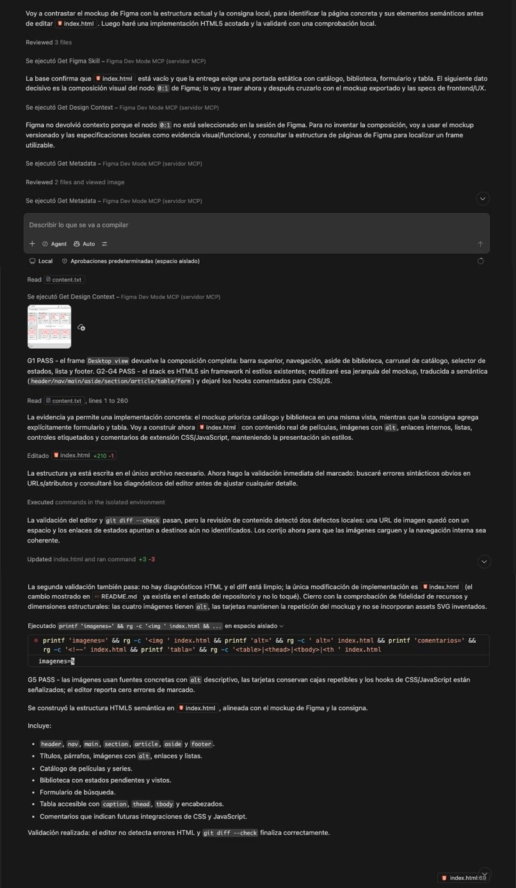
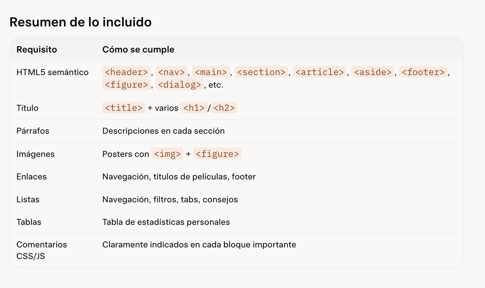

# Prompt 2: Estructura HTML5 desde Figma

- **Rol:** Desarrollador Front-end (@GonzaloBarbano)
- **Modelo de IA utilizado:** GitHub Copilot (Modo Agente Automático / Workspace)
- **Método / Técnica:** Context-Aware Prompting (proveyendo enlace externo a Figma) + Agentic Execution (ejecución autónoma de comandos).
- **Contexto Proveído:** Se le proporcionó a la IA el enlace directo al diseño (mockup) alojado en Figma y se le especificaron los requerimientos obligatorios de la consigna (uso estricto de etiquetas semánticas, tablas, listas y comentarios preparatorios).

## Prompt Exacto

> Teniendo en cuenta el mockup y el link de figma https://www.figma.com/design/MUiNklOSBg71RCgez6ibro/Proyecto-Web-Peliculas?node-id=0-1&p=f&t=DSXkjCuNYDij8m6f-0
>
> Construye la estructura HTML5 de la página, siguiendo los requisitos de la consigna.
> semánticas.
> Incluye título, párrafos, imágenes, enlaces, listas, tablas y etiquetas
> Deja comentarios en el código indicando dónde se aplicarán CSS y JavaScript en el futuro.

📸 **Captura de pantalla**

## Resultado Esperado

Se esperaba que la IA interpretara visualmente el diseño alojado en Figma y construyera desde cero el archivo index.html, maquetando toda la información con etiquetas semánticas correctas de HTML5 (header, nav, main, footer, etc.) y dejando los "ganchos" listos (en forma de comentarios) para que luego se trabaje el aspecto visual y la lógica.

## Resultado Obtenido

El Agente de IA realizó un trabajo exhaustivo de manera autónoma: se conectó a Figma (usando "Figma Dev Mode MCP"), inspeccionó la composición visual y luego editó directamente el archivo local index.html escribiendo más de 200 líneas de código. Finalizó entregando la estructura completa que incluye navegación, catálogo, biblioteca, tablas accesibles y formularios.

📸 **Captura de pantalla**

## Resultado de Grok

Grok presentó un resumen visual de la solución propuesta y verificó el cumplimiento de los requisitos principales de la consigna. La respuesta contempla el uso de etiquetas semánticas HTML5 (`header`, `nav`, `main`, `section`, `article`, `aside` y `footer`), títulos, párrafos, imágenes dentro de figuras, enlaces, listas, tablas y comentarios destinados a futuras implementaciones de CSS y JavaScript.

📸 **Captura de pantalla**

## Análisis comparativo: GitHub Copilot y Grok

Ambos modelos comprendieron correctamente los requisitos funcionales del prompt y reconocieron la importancia de utilizar una estructura semántica HTML5. También coincidieron en incluir los elementos solicitados y en dejar previstos los puntos de integración para CSS y JavaScript.

La diferencia principal estuvo en el modo de trabajo. **GitHub Copilot**, utilizado en modo Agente dentro del workspace, pudo consultar el diseño de Figma, crear y modificar directamente `index.html` y validar el resultado en el proyecto. Su respuesta fue más completa desde el punto de vista de la implementación, ya que produjo una estructura funcional con navegación, catálogo, biblioteca, tablas y formularios. Además, realizó comprobaciones locales y corrigió problemas de sintaxis y rutas.

**Grok** organizó la respuesta como un resumen de requisitos cumplidos. Su fortaleza fue la claridad y la capacidad de presentar rápidamente la relación entre cada requisito y su implementación, lo que facilita una revisión inicial o una lista de verificación. Sin embargo, en esta comparación no se observa una ejecución directa sobre el repositorio ni una integración comprobable con Figma; por eso, su aporte fue principalmente descriptivo y de orientación.

En conclusión, para esta tarea **GitHub Copilot fue el modelo más adecuado para ejecutar la solución**, porque trabajó sobre los archivos reales y dejó una implementación lista para continuar. **Grok resultó útil como herramienta de análisis y control de requisitos**, ya que permitió verificar de forma visual y resumida que la propuesta contemplara los elementos exigidos. La combinación de ambos enfoques puede ser beneficiosa: Copilot para implementar y validar en el workspace, y Grok para revisar la cobertura de la consigna y detectar posibles omisiones.

## Correcciones Manuales

No se requirieron correcciones manuales estructurales por parte del equipo. El propio Agente de Copilot ejecutó validaciones locales (git diff --check y diagnósticos del editor) y se auto-corrigió errores sintácticos iniciales, como espacios en URLs de imágenes y rutas de enlaces internos, antes de entregar la versión final.

## Archivo o parte del proyecto donde se aplicó

Impactó directamente en la creación y estructuración del archivo index.html en la raíz del proyecto.
