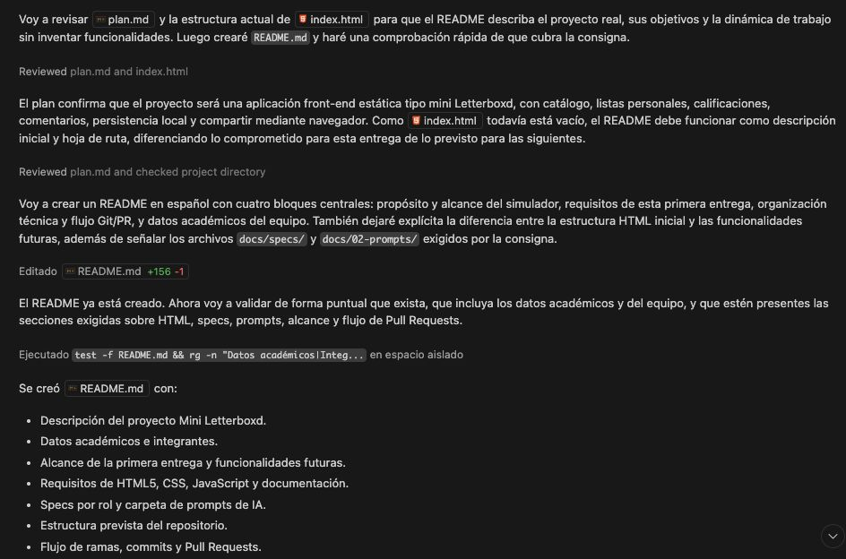

# Prompt 3: Generación del archivo README.md

- **Rol:** Documentador / UX (@GonzaloBarbano)
- **Modelo de IA utilizado:** Claude Sonnet 5
- **Método / Técnica:** Few-Shot (Instrucción directa + Inyección de contexto extenso)
- **Contexto Proveído:** Se le inyectó a la IA la consigna académica completa de la materia "Programación Web I" (incluyendo reglas de Git, requerimientos de entrega y dinámica de PRs). También se le pasaron los datos reales de los miembros del equipo y se le pidió basarse en el `plan.md` previamente creado.

## Prompt Exacto

> Genera el archvo README.md teniendo en cuenta como contexto el plan.md y la consigna:
>
> 2 CONSIGNAS
>
> **Desarrollo de una Página Interactiva: [Tema Libre]**En esta primera entrega, crearás la estructura básica de una página web que servirá
> como base para un proyecto interactivo que desarrollarás a lo largo del curso. La
> página web estará enfocada en [tu tema elegido], ofreciendo información inicial sobre
> el mismo y estableciendo las bases para futuras funcionalidades.
>
> 2.1 REQUERIMIENTOS PARA ESTA ENTREGA
>
> **1. Estructura HTML:**
> Utiliza HTML5 para estructurar la página.
> Incluye elementos básicos como título, párrafos, imágenes, enlaces, listas,
> formularios y tablas relacionados con tu tema.
> Introduce etiquetas semánticas pertinentes para mejorar la accesibilidad y el
> SEO.
>
> **2. Maquetación CSS:**
> No es requerida en esta entrega, pero deja marcadores o comentarios en tu
> código para indicar dónde se aplicarán estilos en futuras entregas.
>
> **3. Interactividad JavaScript:**
> No es requerida en esta entrega, pero planifica y deja marcadores o
> comentarios en tu código para indicar dónde se integrarán funcionalidades
> interactivas en futuras entregas.
>
> **4. Documentación:**
> Incluye comentarios claros y concisos en tu código HTML para explicar la
> estructura y los elementos utilizados.
> Identifica áreas futuras de desarrollo en tu código para guiar las próximas
> etapas del proyecto.
> Antes de iniciar con el desarrollo del proyecto, es fundamental proporcionar
> una descripción detallada del mismo en el archivo **README.md** de tu
> repositorio en GitHub.
>
> **5. Especificación técnica (Spec-Driven Development):**
> Antes de iniciar cualquier tarea de desarrollo, el integrante responsable
> debe redactar una especificación técnica en formato Markdown
> describiendo qué se va a hacer, por qué y con qué criterios se
> considerará terminado. Esta especificación se escribe antes de realizar
> código y se incluye en el PR correspondiente.
>
> Cada rol tiene un archivo asignado en `docs/03-specs/actividad-obligatoria-1/`:
> `docs/03-specs/actividad-obligatoria-1/spec-devops.md`
> `docs/03-specs/actividad-obligatoria-1/spec-frontend.md`
> `docs/03-specs/actividad-obligatoria-1/spec-ux.md`
> `docs/03-specs/actividad-obligatoria-1/spec-ia.md`
>
> Un PR sin su spec no será aprobado. El detalle de responsabilidades
> por rol se encuentra en la sección 3.
>
> **6. IA y Prompt Engineering:**
> En el repositorio, crear una carpeta llamada docs y la subcarpeta
> /02-prompts/, dentro contendra diferentes archivos markdown
> prompts-x.md donde se documenten al menos 5 prompts utilizados con
> modelos de IA diferentes (ChatGPT, Gemini, Claude, Copilot, Cursor, etc.)
> que hayan aportado valor al proyecto actual (no algo ficticio).
>
> 2.2 NOTAS ADICIONALES
>
> La temática de la página es libre, pero debe ser algo que te interese y que te permita
> explorar diferentes aspectos del desarrollo web a medida que avances en la cursada.
> Asegúrate de diseñar la página pensando en su futura escalabilidad y en la
> implementación de funcionalidades interactivas. Crearás una página web interactiva de
> la temática que elijas que permitirá simular distintos procesos. Un “simulador” es un
> programa que soluciona ciertas tareas y proporciona al usuario información de valor,
> pero obviamente hay funcionalidades reales que no soluciona.
>
> **Ejemplos de proyectos finales de otros estudiantes:**
> EMITÍ - Gestión Profesional de Facturas
> LUME - Tienda
> FinGrow - Planificación Financiera
> CineGlobal
> Tienda de Bebidas
> Simulador de préstamos
>
> 2 DINÁMICA PRÁCTICA
>
> La dinámica de trabajo deberá seguir estas pautas:
> Los grupos estarán formados por **4 integrantes**.
> En cada entrega, los integrantes deberán rotar los roles para que todos
> experimenten distintas responsabilidades a lo largo del cuatrimestre.
> Cada rol debe realizar las tareas indicadas y crear la Pull Request (PR)
> asociada a su parte.
> Todos los integrantes deben realizar al menos un commit relevante en su PR.
> Trabajan en ramas propias, nombradas con el formato:
> **feature/<rol>-<descripción>**.
> Hacen PRs a la rama **develop**
> En el changelog.md registran quién hizo qué PR y resumen el aporte concreto,
> incluyendo el link a la PR.
> La rama **master** estará protegida y sólo se integrarán cambios desde develop
> (a partir de una release formal) luego de revisión y aprobación por parte del
> **profesor**.
> La rama **develop** estará protegida y sólo se integrarán cambios desde una
> feature luego de revisión y aprobación por parte del **Coordinador de**
> **Repositorio.**
>
> Los Datos academicos para el readme son:
>
> - **Carrera:** Tecnicatura Universitaria en Programación de Sistemas
> - **Materia:** Programación Web I
>   Los integrantes somos
>   Gonzalo Barbano, matricula 152127, Usuario de Github @GonzaloBarbano
>   David Soria, matricula 153203, usuario @Davidsoria99
>   Kevin Sosa, matricula 154080, usuario @keviineze

## Resultado Esperado

Se buscaba obtener un archivo `README.md` completo y estructurado que sirviera como presentación oficial del proyecto. Debía incluir los datos académicos reales del equipo, la explicación del flujo de ramas (master/develop/features) y el propósito del e-commerce de hardware basado en las especificaciones del `plan.md`.

## Resultado Obtenido

La IA generó exitosamente la documentación principal del repositorio, ordenando de forma prolija (mediante títulos y listas en Markdown) la descripción del proyecto, la dinámica de trabajo exigida por la cátedra y la tabla con los perfiles y matrículas de los tres integrantes.

📸 **Captura de pantalla**

## Correcciones Manuales

No se requirieron correcciones manuales estructurales por parte del equipo.

## Archivo o parte del proyecto donde se aplicó

Se aplicó en la creación del archivo `README.md` ubicado en la raíz del repositorio.
