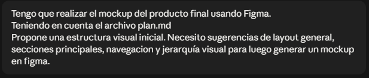
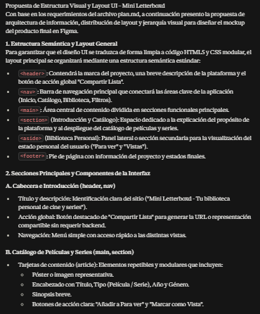
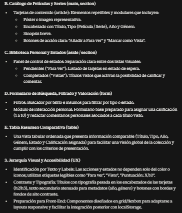
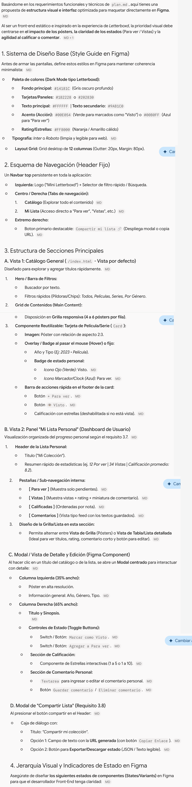

# Prompt 4: Propuesta de Estructura Visual y Layout para Figma

- **Rol:** Documentador / UX (@GonzaloBarbano)
- **Modelo de IA utilizado:** Claude Sonnet 5 + Gemini 1.5 Pro
- **Método / Técnica:** Chain of Thought (Context-aware, referenciando un archivo de requerimientos)
- **Contexto Proveído:** Se le indicó a la IA el objetivo de construir un mockup en Figma, utilizando como única fuente de verdad los requerimientos y alcances ya definidos en el archivo `plan.md`.

## Prompt Exacto

> Tengo que realizar el mockup del producto final usando Figma.
> Teniendo en cuenta el archivo plan.md
> Propone una estructura visual inicial. Necesito sugerencias de layout general, secciones principales, navegacion y jerarquía visual para luego generar un mockup en figma.

📸 **Captura de pantalla**

## Resultado Esperado

Se buscaba obtener una guía estructural (un wireframe lógico o esqueleto) que tradujera los requerimientos técnicos del `plan.md` en componentes visuales concretos, facilitando así el diseño posterior de las pantallas en Figma.

## Resultado Obtenido

La IA entregó una propuesta de arquitectura de la información detallada. Estructuró la respuesta en tres ejes fundamentales:

1. Una estructura semántica mapeada directamente a etiquetas HTML5 (`<header>`, `<nav>`, `<main>`, `<aside>`, etc.).
2. El desglose de los componentes de la interfaz (Tarjetas de catálogo, estados de la biblioteca, formulario de búsqueda y tabla comparativa).
3. Pautas específicas de jerarquía visual y accesibilidad (uso de etiquetas de texto, contraste tipográfico y uso de layouts en grid/flexbox).

📸 **Captura de pantalla**

## Resultado de Gemini

Como segunda respuesta al mismo pedido, Gemini propuso una estructura visual más detallada y directamente trasladable a Figma. La propuesta incluye:

1. Un sistema de diseño base con paleta de colores, tipografía y grilla responsive.
2. Un esquema de navegación con header fijo, filtros, pestañas y acción para compartir la lista.
3. La organización de las vistas principales: catálogo general, panel "Mi Lista Personal", detalle/edición y modal para compartir.
4. Estados y acciones de los componentes, como "Para ver", "Visto", calificación con estrellas y comentarios personales.

📸 **Captura de pantalla**

## Comparación de resultados

Ambas respuestas cumplen con el resultado esperado de convertir los requerimientos del `plan.md` en una guía para diseñar el mockup. La respuesta de Claude aporta una base más conceptual y técnica: relaciona la estructura visual con etiquetas HTML5, separa los componentes principales y considera criterios de jerarquía visual y accesibilidad.

La respuesta de Gemini amplía esa base con decisiones visuales y funcionales más específicas. Define colores, tipografías, distribución en grilla, navegación, pantallas, modales y estados interactivos, por lo que resulta más útil como referencia inmediata para construir los frames y componentes en Figma. Como contrapartida, algunas decisiones de estilo, como el modo oscuro y la tipografía, deberían validarse con el resto del proyecto antes de adoptarse.

En conjunto, se conservaron de Claude los criterios de estructura semántica y accesibilidad, mientras que la propuesta de Gemini se tomó como complemento para concretar el sistema visual, la navegación y los estados de interacción del mockup.

## Correcciones Manuales

No se requirieron correcciones al texto generado. La guía sirvió como base conceptual directa para comenzar a dibujar los componentes (frames) dentro de la herramienta Figma.

## Archivo o parte del proyecto donde se aplicó

Se aplicó como guía teórica para el diseño del mockup en Figma y sirvió como insumo principal para la redacción del archivo `docs/03-specs/actividad-obligatoria-1/spec-ux.md`.
