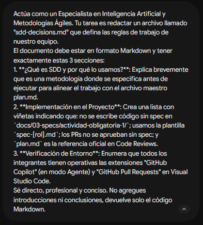
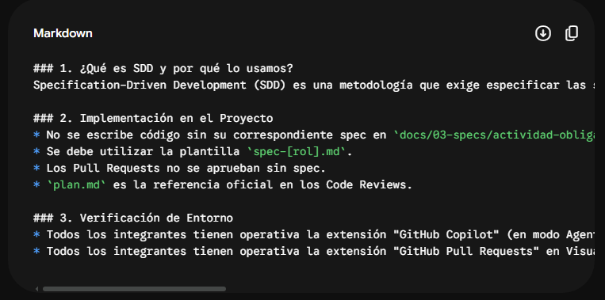

# Prompt 5: Documentación de reglas y entorno para SDD

- **Rol:** Especialista en IA (@Davidsoria99)
- **Modelo de IA utilizado:** Gemini 1.5 Pro
- **Método / Técnica:** Role Prompting + Restricciones de formato (Zero-Shot)
- **Contexto Proveído:** Se le explicó a la IA el objetivo de documentar las normativas internas del equipo para el uso de Spec-Driven Development, definiendo las rutas de carpetas, reglas de Pull Requests y el entorno de extensiones que usamos en Visual Studio Code.

## Prompt Exacto

> > Actúa como un Especialista en Inteligencia Artificial y Metodologías Ágiles. Tu tarea es redactar un archivo llamado "sdd-decisions.md" que defina las reglas de trabajo de nuestro equipo. 
> 
> El documento debe estar en formato Markdown y tener exactamente estas 3 secciones:
> 
> 1. **¿Qué es SDD y por qué lo usamos?**: Explica brevemente que es una metodología donde se especifica antes de ejecutar para alinear el trabajo con el archivo maestro plan.md.
> 2. **Implementación en el Proyecto**: Crea una lista con viñetas indicando que: no se escribe código sin spec en `docs/03-specs/actividad-obligatoria-1/`; usamos la plantilla `spec-[rol].md`; los PRs no se aprueban sin spec; y `plan.md` es la referencia oficial en Code Reviews.
> 3. **Verificación de Entorno**: Enumera que todos los integrantes tienen operativas las extensiones "GitHub Copilot" (en modo Agente) y "GitHub Pull Requests" en Visual Studio Code.
> 
> Sé directo, profesional y conciso. No agregues introducciones ni conclusiones, devuelve solo el código Markdown.

📸 **Captura de pantalla**

## Resultado Esperado

Se buscaba generar un documento reglamentario interno que estableciera de forma clara los pasos que cada desarrollador debe cumplir antes de escribir código y abrir una Pull Request.

## Resultado Obtenido

La IA generó el archivo de decisiones. Respetó la estructura de tres apartados solicitada y utilizó listas con viñetas para que las reglas de implementación y el checklist de herramientas (Copilot y GitHub PRs) sean fáciles de escanear por el equipo.

📸 **Captura de pantalla**

## Correcciones Manuales

No se requirieron correcciones manuales. El prompt fue lo suficientemente restrictivo como para que la IA incluyera las rutas de directorios exactas (`docs/03-specs/actividad-obligatoria-1/`) requeridas por la convención del proyecto.

## Archivo o parte del proyecto donde se aplicó

Se aplicó en la creación del archivo `sdd-decisions.md` para estandarizar el trabajo del equipo.