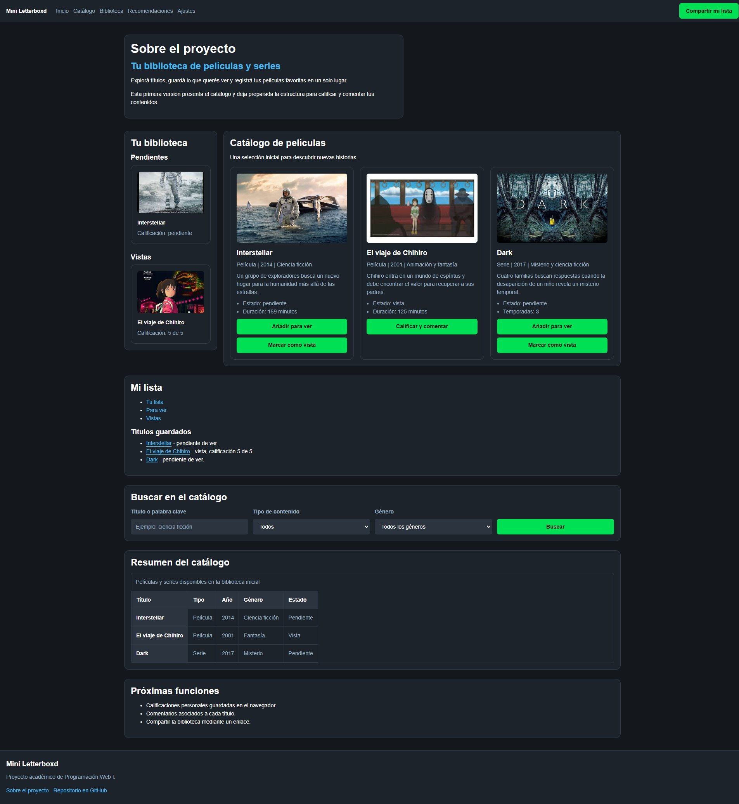
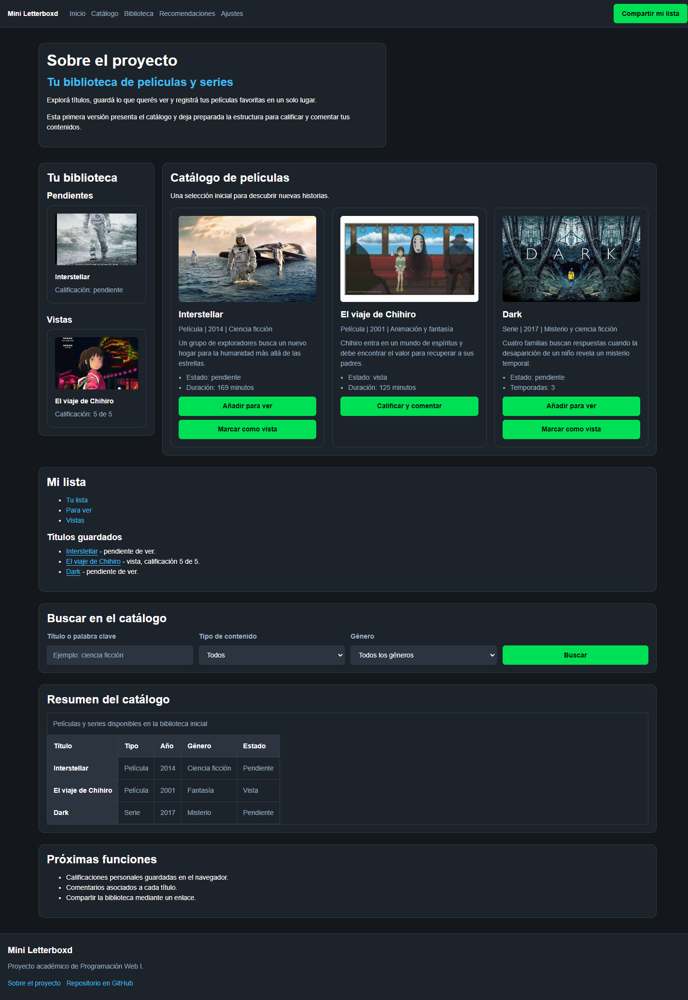
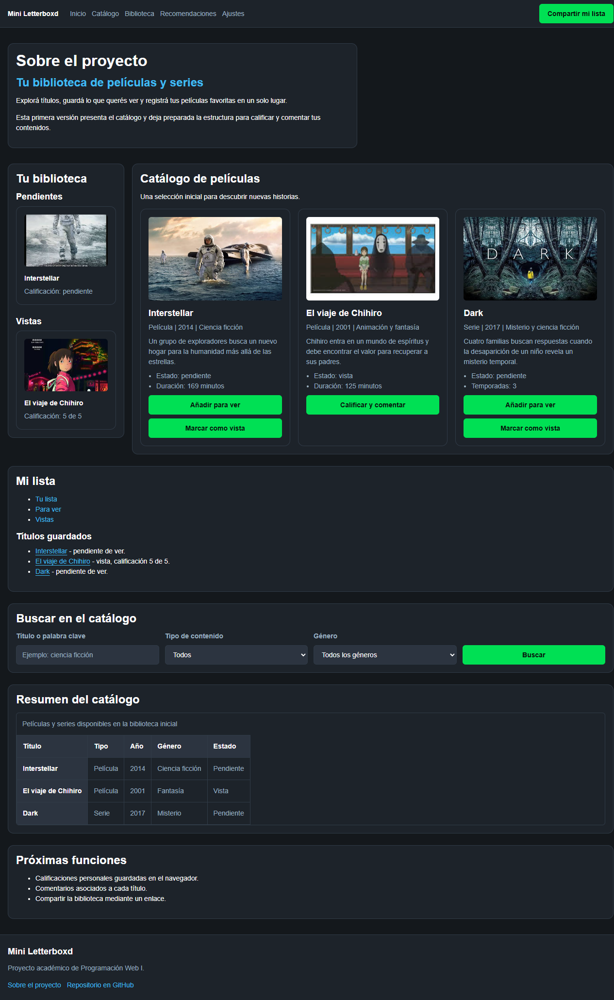
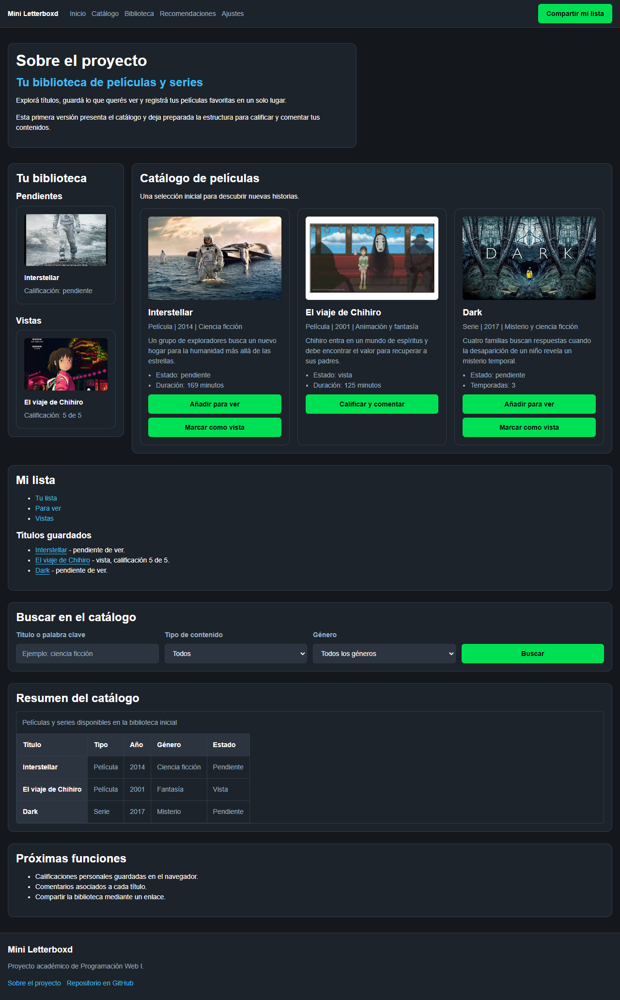

# Test Case 1 — Compatibilidad Visual en Navegadores Desktop

## Metadata
| Campo | Valor |
|-------|-------|
| Responsable | Kevin Ezequiel Sosa|
| Fecha Momento 1 |24-09-26 |
| Fecha Momento 2 | 26-09-26 |
| Rama Momento 1 | `feature/dev-frontend-css-add-styles` |
| Rama Momento 2 | `develop` |
| URL testeada | `http://localhost:3000` |

## Objetivo
Verificar que la página se visualiza correctamente en distintos viewports desktop
sin elementos cortados, desbordados o ilegibles.

## Herramientas utilizadas
- Playwright MCP (`@playwright/mcp`) con viewport emulation
- GitHub Copilot Agent Mode

---

## Prompt para Copilot Agent Mode

Copiá este prompt en Copilot Agent Mode con Playwright MCP activo:

```
Usando Playwright MCP, necesito testear la compatibilidad visual de mi página
en distintos viewports desktop. La URL es http://localhost:3000

Ejecutá estos pasos en orden:
1. Navegá a la URL y esperá que la página cargue completamente
2. Configurá el viewport en 1920x1080 y tomá una captura de pantalla completa
3. Verificá que en este viewport:
   - El header con la navegación sea visible y no se corte
   - Las secciones principales estén en fila horizontal donde corresponda
   - Las tablas sean legibles sin scroll horizontal
   - El footer muestre el texto y los links correctamente
4. Configurá el viewport en 1440x900 y tomá captura completa
5. Configurá el viewport en 1280x800 (simulando Firefox/Safari) y tomá captura completa
6. Configurá el viewport en 1280x800 (simulando Edge) y tomá captura completa
7. En cada viewport reportá si encontrás algún elemento que se corte,
   desborde o no se vea correctamente
8. Generá un resumen con el estado de cada viewport: OK o con problemas

Guardá las capturas en docs/04-testing/capturas/tc-1/momento-X/
(reemplazá X por 1 o 2 según el momento de ejecución)
```

---

## MOMENTO 1 — Pre-merge (rama `feature/`)

### Viewports testeados
| Viewport | Navegador simulado | Navegación | Layout | Tabla | Footer | Estado |
|----------|--------------------|------------|--------|-------|--------|--------|
| 1920×1080 | Chrome | OK | OK | OK | OK | OK |
| 1440×900 | Chrome | OK | OK | OK | OK | OK |
| 1280×800 | Firefox / Safari | OK | OK | OK | OK | OK |
| 1280×800 | Edge | OK | OK | OK | OK | OK |

### Capturas de pantalla
| Viewport | Captura | Estado |
|----------|---------|--------|
| 1920×1080 |  | OK |
| 1440×900 |  | OK |
| 1280×800 Firefox/Safari |  | OK |
| 1280×800 Edge |  | OK |

### Hallazgos
| # | Elemento | Viewport afectado | Descripción | Severidad |
|---|----------|-------------------|-------------|-----------|
| — | — | Ninguno | No se encontraron cortes, desbordamientos horizontales ni problemas visuales en ninguno de los cuatro viewports. | — |

### Resultado Momento 1
- [x] ✅ PASS — Sin hallazgos
- [ ] ⚠️ FAIL CON OBSERVACIONES
- [ ] ❌ FAIL

---

## MOMENTO 2 — Post-merge (`develop`)

### Viewports testeados
| Viewport | Navegador simulado | Navegación | Layout | Tabla | Footer | Estado |
|----------|--------------------|------------|--------|-------|--------|--------|
| 1920×1080 | Chrome | OK | OK | OK | OK | OK |
| 1440×900 | Chrome | OK | OK | OK | OK | OK |
| 1280×800 | Firefox / Safari (viewport emulado) | OK | OK | OK | OK | OK |
| 1280×800 | Edge (viewport emulado) | OK | OK | OK | OK | OK |

**Nota de ejecución:** Playwright MCP reportó Chromium 153 como motor/User-Agent en las cuatro pruebas. Las capturas Firefox/Safari y Edge verifican el viewport solicitado, pero no sustituyen una ejecución en los motores nativos de esos navegadores.

### Capturas de pantalla
| Viewport | Captura | Estado |
|----------|---------|--------|
| 1920×1080 |  | OK |
| 1440×900 |  | OK |
| 1280×800 Firefox/Safari (viewport emulado) |  | OK |
| 1280×800 Edge (viewport emulado) |  | OK |

### Hallazgos
| # | Elemento | Viewport afectado | Descripción | Severidad |
|---|----------|-------------------|-------------|-----------|
| — | — | Ninguno | No se observaron cortes, desbordamientos horizontales ni contenido ilegible. Header, navegación, layout, tabla y footer se visualizaron correctamente en los cuatro viewports. | — |

### Resultado Momento 2
- [x] ✅ PASS — Sin hallazgos visuales en los cuatro viewports emulados
- [ ] ⚠️ FAIL CON OBSERVACIONES
- [ ] ❌ FAIL

---

## Issues creados
| Issue | Momento | Elemento | Severidad | Estado |
|-------|---------|----------|-----------|--------|
| Ninguno | Momento 2 | — | — | No se crearon Issues; no se detectaron bugs visuales |

## Conclusión general
**Resultado Momento 1:** PASS — Sin hallazgos.  
**Resultado Momento 2:** PASS — Sin hallazgos visuales en 1920×1080, 1440×900 y 1280×800. No se detectaron cortes, desbordamiento horizontal ni problemas de legibilidad; la navegación, el layout, la tabla y el footer se mantuvieron visibles y correctos. No se crearon Issues. Las pruebas con etiqueta Firefox/Safari y Edge se ejecutaron con viewport emulado en Chromium 153, por lo que se recomienda confirmar en los motores nativos para certificar compatibilidad entre navegadores.