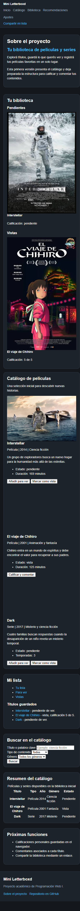
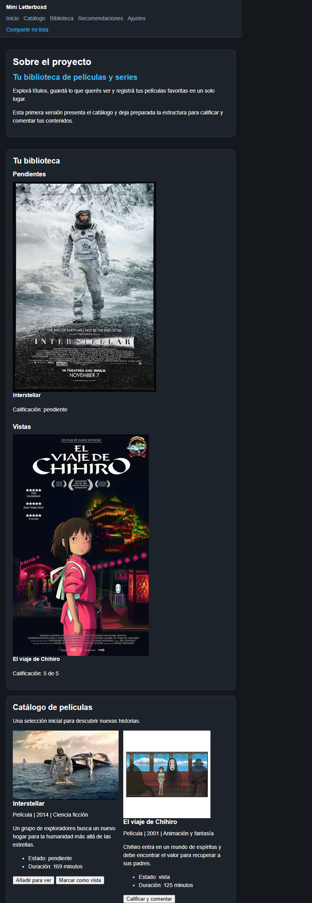
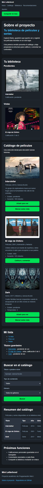
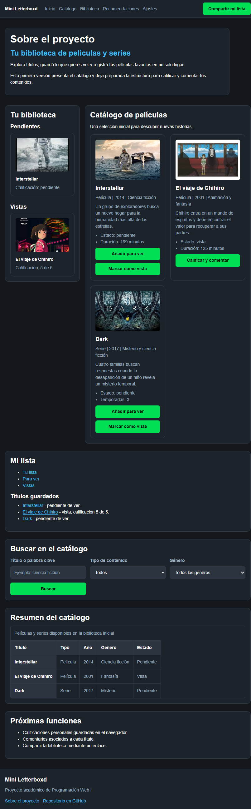

# Test Case 2 — Responsive en Dispositivos Móviles

## Metadata
| Campo | Valor |
|-------|-------|
| Responsable | Kevin Ezequiel Sosa|
| Fecha Momento 1 | 25/09/2026 |
| Fecha Momento 2 | 27/09/2026 |
| Rama Momento 1 | `feature/responsive-design-add-responsive-styles` |
| Rama Momento 2 | `develop` |
| URL testeada | `http://localhost:3000` |

## Objetivo
Verificar que el diseño responsive funciona correctamente en móviles y tablets,
sin desbordamientos ni scroll horizontal involuntario.

## Herramientas utilizadas
- Playwright MCP (`@playwright/mcp`) con viewport emulation
- GitHub Copilot Agent Mode

---

## Prompt para Copilot Agent Mode

Copiá este prompt en Copilot Agent Mode con Playwright MCP activo:

```
Usando Playwright MCP, necesito testear el diseño responsive de
http://localhost:3000 en distintos dispositivos móviles.

Ejecutá estos pasos en orden:

1. Configurá el viewport en 390x844 (iPhone 14 Pro)
   - Navegá a la página y tomá captura completa
   - Verificá si la navegación se adapta sin desbordarse
   - Verificá si los elementos se apilan verticalmente donde corresponde
   - Verificá si alguna tabla genera scroll horizontal
   - Verificá si el formulario ocupa el ancho completo
   - Verificá si hay scroll horizontal en la página

2. Configurá el viewport en 412x915 (Samsung Galaxy S23) y repetí los mismos pasos

3. Configurá el viewport en 820x1180 (iPad Air) y repetí los mismos pasos

4. Para cada dispositivo reportá qué elementos se ven correctamente
   y cuáles tienen problemas visuales

5. Generá un resumen indicando qué dispositivo presenta más problemas

Guardá las capturas en docs/04-testing/capturas/tc-2/momento-X/
(reemplazá X por 1 o 2 según el momento de ejecución)
```

---

## MOMENTO 1 — Pre-merge (rama `feature/`)

### Dispositivos testeados
| Dispositivo | Viewport | Navegación | Layout móvil | Tabla | Formulario | Scroll horizontal | Estado |
|-------------|----------|------------|--------------|-------|------------|-------------------|--------|
| iPhone 14 Pro | 390×844 | OK | OK | OK | OK | OK | OK |
| Samsung Galaxy S23 | 412×915 | OK | OK | OK | OK | OK | OK |
| iPad Air | 820×1180 | OK | OK | OK | OK | OK | OK |

### Capturas de pantalla
| Dispositivo | Captura | Estado |
|-------------|---------|--------|
| iPhone 14 Pro |  | OK |
| Samsung Galaxy S23 |  | OK |
| iPad Air |  | OK |

### Hallazgos
| # | Elemento | Dispositivo afectado | Descripción | Desbordamiento | Severidad |
|---|----------|----------------------|-------------|----------------|-----------|
| — | — | Ninguno | No se encontraron cortes, problemas visuales ni desbordamiento horizontal en los tres dispositivos. | No | — |

### Resultado Momento 1
- [x] ✅ PASS — Sin hallazgos
- [ ] ⚠️ FAIL CON OBSERVACIONES
- [ ] ❌ FAIL

---

## MOMENTO 2 — Post-merge (`develop`)

### Dispositivos testeados
| Dispositivo | Viewport | Navegación | Layout móvil | Tabla | Formulario | Scroll horizontal | Estado |
|-------------|----------|------------|--------------|-------|------------|-------------------|--------|
| iPhone 14 Pro | 390×844 | OK, navegación envuelta en dos filas sin corte | OK, contenido apilado | Recortada; columnas derechas no accesibles | OK, controles a ancho completo | No en la página; tabla recortada | ⚠️ Observaciones |
| Samsung Galaxy S23 | 412×915 | OK, navegación en una fila sin corte | OK, contenido apilado | Recortada; columnas derechas no accesibles | OK, controles a ancho completo | No en la página; tabla recortada | ⚠️ Observaciones |
| iPad Air | 820×1180 | OK | OK, biblioteca y catálogo en columnas | OK, tabla completa visible | OK, formulario ocupa el espacio disponible | No | OK |

### Capturas de pantalla
| Dispositivo | Captura | Estado |
|-------------|---------|--------|
| iPhone 14 Pro |  | Observación: tabla recortada |
| Samsung Galaxy S23 |  | Observación: tabla recortada |
| iPad Air |  | OK |

### Hallazgos
| # | Elemento | Dispositivo afectado | Descripción | Desbordamiento | Severidad |
|---|----------|----------------------|-------------|----------------|-----------|
| 1 | Tabla de resumen del catálogo | iPhone 14 Pro (390×844), Samsung Galaxy S23 (412×915) | La tabla mide 482 px de ancho, excede su área visible (307 px y 329 px respectivamente) y no cuenta con un contenedor desplazable; las columnas de la derecha quedan recortadas. La página no tiene scroll horizontal. En iPad Air (820×1180) la tabla cabe completa. | Sí, dentro de la tabla; no en la página | Media |

### Resultado Momento 2
- [ ] ✅ PASS — Sin hallazgos
- [x] ⚠️ FAIL CON OBSERVACIONES — Tabla recortada en los dos viewports de teléfono
- [ ] ❌ FAIL

---

## Issues creados
| Issue | Momento | Elemento | Dispositivo | Severidad | Estado |
|-------|---------|----------|-------------|-----------|--------|
| [#31 — Tabla del catálogo recortada en viewports móviles](https://github.com/keviineze/proyecto-web-peliculas/issues/31) | Momento 2 | Tabla de resumen del catálogo | iPhone 14 Pro y Samsung Galaxy S23 | Media | Abierto |

## Conclusión general
**Resultado Momento 1:** PASS — Sin hallazgos.  
**Resultado Momento 2:** FAIL CON OBSERVACIONES — El layout responsive se adapta y no hay scroll horizontal global en los tres dispositivos. Sin embargo, la tabla de resumen recorta sus columnas derechas en iPhone 14 Pro (390×844) y Samsung Galaxy S23 (412×915), aunque se visualiza completa en iPad Air (820×1180). Se creó el Issue [#31](https://github.com/keviineze/proyecto-web-peliculas/issues/31) para seguimiento. No se modificó la implementación.