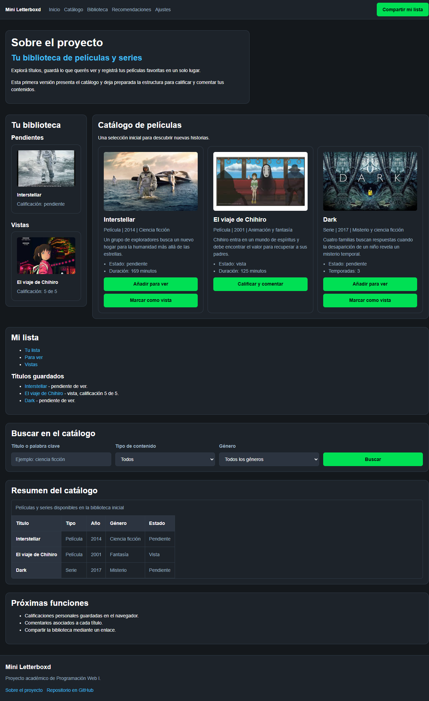

# Test Case 3 — Performance y Carga

## Metadata
| Campo | Valor |
|-------|-------|
| Responsable | Kevin Ezequiel Sosa|
| Fecha Momento 1 |24-09-26 |
| Fecha Momento 2 | |
| Rama Momento 1 | `feature/dev-frontend-css-add-styles` |
| Rama Momento 2 | `develop` |
| URL testeada | `http://localhost:3000` |

## Objetivo
Medir los tiempos de carga y el tamaño de los recursos principales de la página
para detectar problemas de performance antes del merge a develop.

## Herramientas utilizadas
- Playwright MCP (`@playwright/mcp`) con evaluación de la Performance API del navegador
- GitHub Copilot Agent Mode

---

## Prompt para Copilot Agent Mode

Copiá este prompt en Copilot Agent Mode con Playwright MCP activo:

```
Usando Playwright MCP, necesito analizar la performance de http://localhost:3000

Ejecutá estos pasos en orden:

1. Navegá a la URL esperando Network idle
2. Usá evaluate() para ejecutar:
   window.performance.getEntriesByType("navigation")[0]
   y extraé: domContentLoadedEventEnd, loadEventEnd, domInteractive
3. Usá evaluate() para obtener window.performance.getEntriesByType("resource")
   y listá cada recurso con su name, transferSize y duration
4. Tomá una captura de pantalla del estado final cargado
5. Reportá:
   - Tiempo hasta DOMContentLoaded (ms)
   - Tiempo hasta Load completo (ms)
   - Tiempo hasta DOM Interactive (ms)
   - Listado de recursos: nombre, tipo, tamaño (KB) y tiempo de descarga (ms)
   - Total de recursos y tamaño total acumulado
   - ¿Hay recursos que superen 500KB?
   - ¿Hay recursos que tarden más de 500ms en descargar?
6. Generá un resumen con estado OK o con problemas por cada métrica

Guardá las capturas en docs/04-testing/capturas/tc-3/momento-X/
(reemplazá X por 1 o 2 según el momento de ejecución)
```

---

## MOMENTO 1 — Pre-merge (rama `feature/`)

### Métricas de performance
| Métrica | Valor medido | Umbral recomendado | Estado |
|---------|-------------|-------------------|--------|
| DOMContentLoaded | 16,2 ms | < 800 ms | OK |
| DOM Interactive | 16,1 ms | < 600 ms | OK |
| Load completo | 18,9 ms | < 2000 ms | OK |
| Total de recursos | 7 | — | OK |
| Tamaño total | 2,051 KB | < 1 MB | OK |

### Recursos analizados
| Recurso | Tipo | Tamaño (KB) | Tiempo descarga (ms) | Estado |
|---------|------|-------------|----------------------|--------|
| `http://localhost:3000/css/styles.css` | CSS / link | 0,293 | 4,6 | OK |
| `http://localhost:3000/css/components.css` | CSS / link | 0,293 | 5,0 | OK |
| `http://localhost:3000/assets/images/interestellar.jpeg` | Imagen / img | 0,293 | 4,9 | OK |
| `http://localhost:3000/assets/images/chihiro-2.jpeg` | Imagen / img | 0,293 | 7,2 | OK |
| `http://localhost:3000/assets/images/chihiro.jpeg` | Imagen / img | 0,293 | 7,4 | OK |
| `http://localhost:3000/assets/images/interestellar-2.jpeg` | Imagen / img | 0,293 | 7,7 | OK |
| `http://localhost:3000/assets/images/dark.jpeg` | Imagen / img | 0,293 | 8,2 | OK |

### Capturas de pantalla
| Descripción | Captura |
|-------------|---------|
| Estado final cargado |  |

### Hallazgos
| # | Métrica / Recurso | Valor | Descripción | Severidad |
|---|-------------------|-------|-------------|-----------|
| — | — | — | No se detectaron recursos superiores a 500 KB ni recursos con tiempo de descarga mayor a 500 ms. | — |

### Resultado Momento 1
- [x] ✅ PASS — Sin hallazgos
- [ ] ⚠️ FAIL CON OBSERVACIONES
- [ ] ❌ FAIL

---

## MOMENTO 2 — Post-merge (`develop`)

### Métricas de performance
| Métrica | Valor medido | Umbral recomendado | Estado |
|---------|-------------|-------------------|--------|
| DOMContentLoaded | ms |  — | |
| DOM Interactive | ms |  — | |
| Load completo | ms |  — | |
| Total de recursos | | — | |
| Tamaño total | KB |  — | |

### Recursos analizados
| Recurso | Tipo | Tamaño (KB) | Tiempo descarga (ms) | Estado |
|---------|------|-------------|----------------------|--------|
| | | | | |
| | | | | |
| | | | | |

### Capturas de pantalla
| Descripción | Captura |
|-------------|---------|
| Estado final cargado |  |

### Hallazgos
| # | Métrica / Recurso | Valor | Descripción | Severidad |
|---|-------------------|-------|-------------|-----------|
| | | | | |

### Resultado Momento 2
- [ ] ✅ PASS — Sin hallazgos
- [ ] ⚠️ FAIL CON OBSERVACIONES
- [ ] ❌ FAIL

---

## Issues creados
| Issue | Momento | Métrica / Recurso | Severidad | Estado |
|-------|---------|-------------------|-----------|--------|
| | | | | |

## Conclusión general
**Resultado final:** <!-- PASS / FAIL CON OBSERVACIONES / FAIL -->

<!-- Escribí un resumen de los hallazgos más importantes y las acciones requeridas -->