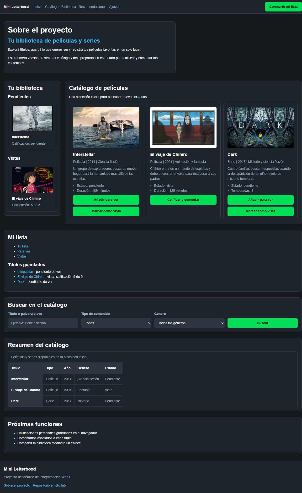

# Test Case 4 — Accesibilidad Web (axe-core)

## Metadata
| Campo | Valor |
|-------|-------|
| Responsable | Kevin Ezequiel Sosa|
| Fecha Momento 1 |24-09-26 |
| Fecha Momento 2 | 27-09-26 |
| Rama Momento 1 | `feature/dev-frontend-css-add-styles` |
| Rama Momento 2 | `develop` |
| URL testeada | `http://localhost:3000` |

## Objetivo
Detectar violaciones de accesibilidad WCAG 2.1 mediante análisis automatizado
con axe-core, identificando elementos que impidan el acceso a usuarios con discapacidades.

## Herramientas utilizadas
- Playwright MCP (`@playwright/mcp`) con inyección de axe-core
- GitHub Copilot Agent Mode

---

## Prompt para Copilot Agent Mode

Copiá este prompt en Copilot Agent Mode con Playwright MCP activo:

```
Usando Playwright MCP, necesito hacer un análisis de accesibilidad de
http://localhost:3000 usando axe-core.

Ejecutá estos pasos en orden:

1. Navegá a la URL y esperá que cargue completamente
2. Inyectá axe-core desde CDN:
   await page.addScriptTag({
     url: 'https://cdnjs.cloudflare.com/ajax/libs/axe-core/4.7.2/axe.min.js'
   })
3. Ejecutá el análisis completo:
   const results = await page.evaluate(() => axe.run())
4. Tomá una captura de pantalla de la página
5. Reportá TODAS las violaciones encontradas con:
   - ID de la regla violada
   - Descripción del problema
   - Impacto (critical / serious / moderate / minor)
   - Selector del elemento HTML afectado
   - Sugerencia de corrección
6. Reportá también los incomplete (necesitan revisión manual)
7. Generá un resumen: total de violaciones agrupadas por nivel de impacto

Guardá las capturas en docs/04-testing/capturas/tc-4/momento-X/
(reemplazá X por 1 o 2 según el momento de ejecución)
```

---

## MOMENTO 1 — Pre-merge (rama `feature/`)

### Violaciones encontradas
| # | Regla axe | Impacto | Elemento afectado | Descripción |
|---|-----------|---------|-------------------|-------------|
| 1 | `link-in-text-block` | serious | `a[href$="#interstellar"]` | El enlace “Interstellar” tiene contraste insuficiente (2,16:1; requiere 3:1) y no se distingue del texto circundante mediante subrayado u otro estilo. Aumentar el contraste y/o agregar una diferenciación visual persistente. |
| 2 | `link-in-text-block` | serious | `a[href$="#chihiro"]` | El enlace “El viaje de Chihiro” tiene contraste insuficiente (2,16:1; requiere 3:1) y no se distingue del texto circundante mediante subrayado u otro estilo. Aumentar el contraste y/o agregar una diferenciación visual persistente. |
| 3 | `link-in-text-block` | serious | `a[href$="#dark"]` | El enlace “Dark” tiene contraste insuficiente (2,16:1; requiere 3:1) y no se distingue del texto circundante mediante subrayado u otro estilo. Aumentar el contraste y/o agregar una diferenciación visual persistente. |

### Needs Review (incomplete)
| # | Regla axe | Elemento | Descripción |
|---|-----------|----------|-------------|
| — | — | — | No se encontraron resultados incomplete que requieran revisión manual. |

### Capturas de pantalla
| Descripción | Captura |
|-------------|---------|
| Estado general de la página |  |

### Resumen por nivel de impacto
| Nivel | Cantidad | Reglas |
|-------|----------|--------|
| 🔴 critical | 0 | — |
| 🟠 serious | 3 | `link-in-text-block` |
| 🟡 moderate | 0 | — |
| 🔵 minor | 0 | — |
| **Total** | 3 | `link-in-text-block` |

### Resultado Momento 1
- [ ] ✅ PASS — Sin violaciones
- [ ] ⚠️ FAIL CON OBSERVACIONES — Solo violaciones moderate/minor
- [x] ❌ FAIL — Violaciones critical o serious presentes

---

## MOMENTO 2 — Post-merge (`develop`)

### Violaciones encontradas
| # | Regla axe | Impacto | Elemento afectado | Descripción |
|---|-----------|---------|-------------------|-------------|
| — | — | — | — | No se encontraron violaciones axe-core en esta ejecución. La regla `link-in-text-block`, registrada en Momento 1 para `a[href$="#interstellar"]`, `a[href$="#chihiro"]` y `a[href$="#dark"]`, no se reprodujo. |

### Needs Review (incomplete)
| # | Regla axe | Elemento | Descripción |
|---|-----------|----------|-------------|
| — | — | — | No se encontraron resultados incomplete que requieran revisión manual. |

### Capturas de pantalla
| Descripción | Captura |
|-------------|---------|
| Estado general de la página |  |

### Resumen por nivel de impacto
| Nivel | Cantidad | Reglas |
|-------|----------|--------|
| 🔴 critical | 0 | — |
| 🟠 serious | 0 | — |
| 🟡 moderate | 0 | — |
| 🔵 minor | 0 | — |
| **Total** | **0** | — |

**Ejecución:** axe-core 4.7.2; 44 reglas pasaron y 42 fueron no aplicables.

### Resultado Momento 2
- [x] ✅ PASS — Sin violaciones
- [ ] ⚠️ FAIL CON OBSERVACIONES — Solo violaciones moderate/minor
- [ ] ❌ FAIL — Violaciones critical o serious presentes

---

## Issues creados
| Issue | Momento | Regla axe | Elemento | Impacto | Estado |
|-------|---------|-----------|----------|---------|--------|
| [#27](https://github.com/keviineze/proyecto-web-peliculas/issues/27) | Momento 1 | `link-in-text-block` | Tres enlaces de la lista completa (`#interstellar`, `#chihiro`, `#dark`) | serious | Abierto |
| — | Momento 2 | No se creó un Issue nuevo: no se encontraron violaciones | — | — | — |

## Decisiones tomadas
La violación `link-in-text-block` se consideró un bug de accesibilidad porque axe-core detectó contraste insuficiente (2,16:1 frente al mínimo requerido de 3:1) y falta de diferenciación visual adicional en tres enlaces de texto. Debe corregirse aumentando el contraste y/o agregando subrayado u otro estilo persistente. No se descartaron violaciones. No se encontraron resultados incomplete, por lo que no hubo hallazgos pendientes de revisión manual. No se creó un issue en esta ejecución.

## Conclusión general
**Resultado final:** PASS en Momento 2. La nueva ejecución con axe-core 4.7.2 no encontró violaciones ni resultados incomplete; las tres instancias `link-in-text-block` de Momento 1 no se reprodujeron.