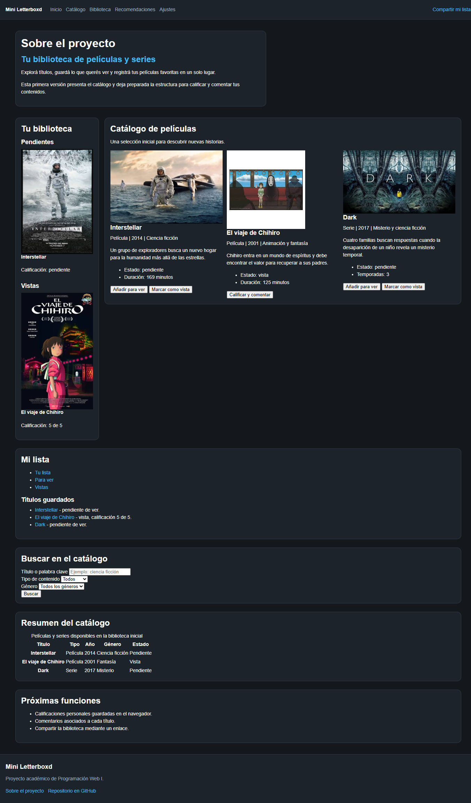
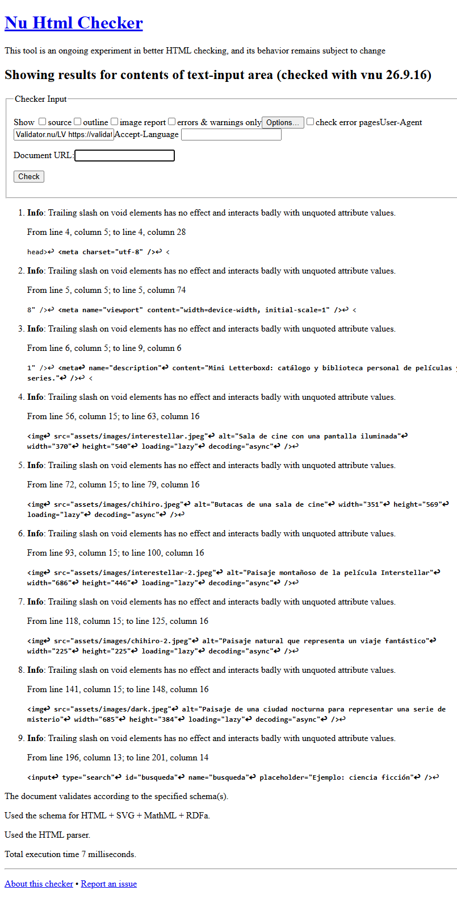
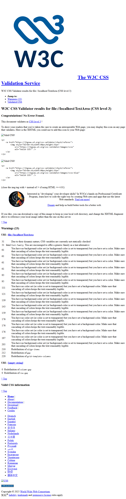
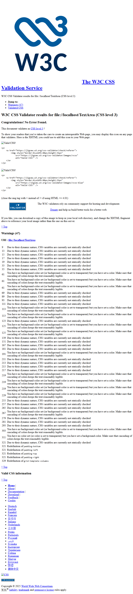
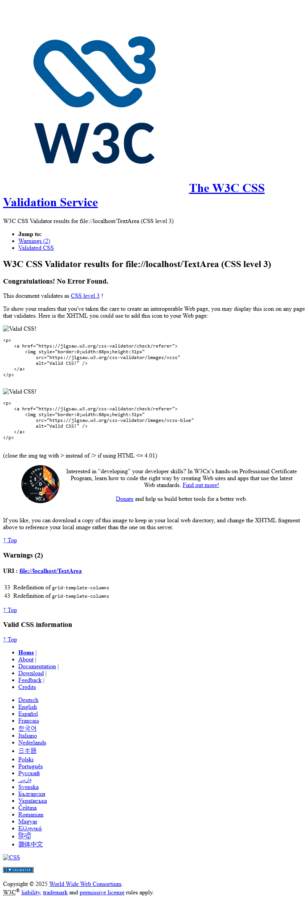

# Test Case 5 — Estructura HTML Semántica y Validación CSS/HTML

## Metadata
| Campo | Valor |
|-------|-------|
| Responsable | Kevin Ezequiel Sosa |
| Fecha Momento 1 |24-09-26 |
| Fecha Momento 2 | |
| Rama Momento 1 | `feature/responsive-design-add-responsive-styles` |
| Rama Momento 2 | `develop` |
| URL testeada | `http://localhost:3000` |

## Objetivo
Verificar que la página utilice HTML5 semántico correctamente y que el código
HTML y CSS sea válido según los estándares del W3C.

## Herramientas utilizadas
- Playwright MCP (`@playwright/mcp`) con snapshot de accesibilidad
- W3C HTML Validator API (`validator.w3.org`) vía curl
- W3C CSS Validator API (`jigsaw.w3.org/css-validator`) vía curl
- GitHub Copilot Agent Mode

---

## Prompt para Copilot Agent Mode

Copiá este prompt en Copilot Agent Mode con Playwright MCP activo:

```
Usando Playwright MCP y herramientas disponibles, necesito analizar la
estructura semántica y validar el código de http://localhost:3000

PARTE 1 — Estructura HTML semántica

1. Navegá a http://localhost:3000 con Playwright MCP y tomá un snapshot
   de accesibilidad completo
2. Del snapshot extraé y listá:
   - Todos los headings (h1-h6) con nivel y texto
   - Todos los landmarks (header, nav, main, footer, section, article)
   - Cualquier <div> donde debería ir un elemento semántico
3. Verificá:
   - ¿Hay un solo h1?
   - ¿La jerarquía de headings no tiene saltos (h1→h2→h3)?
   - ¿Todos los campos del formulario tienen <label> asociado?
   - ¿Las tablas tienen <caption>?
4. Tomá captura de pantalla de la página

PARTE 2 — Validación HTML con W3C

Usá este comando para validar el archivo index.html:

cat index.html | curl -s -F 'uploaded_file=@-' -F 'output=json' \
  https://validator.w3.org/check | jq '.'

Reportá:
- Total de errores y warnings
- Por cada error: número de línea, descripción y fragmento de código afectado

PARTE 3 — Validación CSS con W3C

Para cada archivo CSS ejecutá:

cat css/styles.css | curl -s \
  -F 'file=@-;type=text/css' \
  -F 'output=json' \
  'https://jigsaw.w3.org/css-validator/validator' | jq '.'

Repetí para css/components.css y css/responsive.css

Reportá por cada archivo:
- Total de errores y warnings
- Por cada error: número de línea, propiedad afectada y descripción

RESUMEN FINAL

Generá una tabla consolidada con:
- Estado de estructura semántica
- Total errores HTML
- Total errores CSS por archivo
- Lista de issues a crear

Guardá las capturas en docs/04-testing/capturas/tc-5/momento-X/
(reemplazá X por 1 o 2 según el momento de ejecución)
```

---

## MOMENTO 1 — Pre-merge (rama `feature/`)

### Estructura de headings
| Nivel | Texto | ¿Correcto? | Observación |
|-------|-------|-----------|-------------|
| H1 | Sobre el proyecto | Sí | Único H1 detectado. |
| H2 | Tu biblioteca de películas y series | Sí | Jerarquía correcta. |
| H2 | Tu biblioteca | Sí | Jerarquía correcta. |
| H3 | Pendientes | Sí | Jerarquía correcta. |
| H4 | Interstellar | Sí | Jerarquía correcta. |
| H3 | Vistas | Sí | Jerarquía correcta. |
| H4 | El viaje de Chihiro | Sí | Jerarquía correcta. |
| H2 | Catálogo de películas | Sí | Jerarquía correcta. |
| H3 | Interstellar | Sí | Jerarquía correcta. |
| H3 | El viaje de Chihiro | Sí | Jerarquía correcta. |
| H3 | Dark | Sí | Jerarquía correcta. |
| H2 | Mi lista | Sí | Jerarquía correcta. |
| H3 | Títulos guardados | Sí | Jerarquía correcta. |
| H2 | Buscar en el catálogo | Sí | Jerarquía correcta. |
| H2 | Resumen del catálogo | Sí | Jerarquía correcta. |
| H2 | Próximas funciones | Sí | Jerarquía correcta. |
| H2 | Mini Letterboxd | Sí | Jerarquía correcta. |

### Landmarks detectados
| Landmark | Elemento HTML | ¿Correcto? | Observación |
|----------|---------------|-----------|-------------|
| header | `<header>` | Sí | Encabezado principal detectado. |
| nav | `<nav aria-label="Navegación principal">` | Sí | Navegación principal identificada. |
| main | `<main id="inicio">` | Sí | Contenido principal identificado. |
| section | `<section id="sobre-proyecto">` | Sí | Sección semántica con heading. |
| section | `<section id="lista-pendientes">` | Sí | Sección semántica con heading. |
| article | `<article>` — Interstellar | Sí | Contenido independiente de película. |
| section | `<section id="lista-vistas">` | Sí | Sección semántica con heading. |
| article | `<article>` — El viaje de Chihiro | Sí | Contenido independiente de película. |
| section | `<section id="catalogo">` | Sí | Sección semántica con heading. |
| article | `<article>` — Interstellar | Sí | Contenido independiente de película. |
| article | `<article>` — El viaje de Chihiro | Sí | Contenido independiente de película. |
| article | `<article>` — Dark | Sí | Contenido independiente de serie. |
| section | `<section>` — Mi lista | Sí | Sección semántica con heading. |
| nav | `<nav aria-label="Estados de mi lista">` | Sí | Navegación secundaria identificada. |
| section | `<section id="lista-completa">` | Sí | Sección semántica con heading. |
| section | `<section id="recomendaciones">` | Sí | Sección semántica con heading. |
| section | `<section>` — Resumen del catálogo | Sí | Sección semántica con heading. |
| section | `<section id="ajustes">` | Sí | Sección semántica con heading. |
| footer | `<footer id="compartir">` | Sí | Pie de página identificado. |

### Verificaciones semánticas
| Verificación | Estado | Detalle |
|--------------|--------|---------|
| Un solo H1 | OK | Se detectó exactamente un H1: “Sobre el proyecto”. |
| Jerarquía de headings sin saltos | OK | No se detectaron saltos en la jerarquía observada. |
| Secciones con elementos semánticos | OK | Se utilizaron header, nav, main, section, article y footer. |
| Campos de formulario con label | OK | `input#busqueda`, `select#tipo` y `select#genero` tienen label asociado. |
| Tabla/s con caption | OK | La tabla tiene caption: “Películas y series disponibles en la biblioteca inicial”. |

### Validación W3C HTML
| Tipo | Cantidad | Detalle |
|------|----------|---------|
| Errores | 0 | HTML válido según W3C. |
| Warnings | 1 | Advertencia informativa por barras finales en elementos void. |

### Validación W3C CSS
| Archivo | Errores | Warnings |
|---------|---------|----------|
| styles.css | 0 | 1 — Variables CSS no verificadas estáticamente. |
| components.css | No validado en Momento 1 | No disponible en la rama evaluada; se contemplará en Momento 2 tras el merge. |
| responsive.css | 5 | 3 — Extensiones de proveedor `-webkit-`. |

### Capturas de pantalla
| Descripción | Captura |
|-------------|---------|
| Snapshot accesibilidad |  |
| W3C HTML Validator | No se tomó captura específica. |
| W3C CSS — styles.css | No se tomó captura específica. |
| W3C CSS — components.css | No se tomó captura específica; se validará en Momento 2. |
| W3C CSS — responsive.css | No se tomó captura específica. |

### Hallazgos
| # | Tipo | Elemento / Archivo | Descripción | Severidad |
|---|------|--------------------|-------------|-----------|
| 1 | Validación CSS | `css/responsive.css` | El W3C reportó 5 errores de parseo en las líneas 6, 11, 16, 34 y 376. El archivo contiene texto ajeno a CSS y bloques Markdown. | Alta |

### Resultado Momento 1
- [ ] ✅ PASS — Sin hallazgos
- [x] ⚠️ FAIL CON OBSERVACIONES
- [ ] ❌ FAIL

---

## MOMENTO 2 — Post-merge (`develop`)

### Estructura de headings
| Nivel | Texto | ¿Correcto? | Observación |
|-------|-------|-----------|-------------|
| | | | |
| | | | |

### Landmarks detectados
| Landmark | Elemento HTML | ¿Correcto? | Observación |
|----------|---------------|-----------|-------------|
| | | | |
| | | | |

### Verificaciones semánticas
| Verificación | Estado | Detalle |
|--------------|--------|---------|
| Un solo H1 | | |
| Jerarquía de headings sin saltos | | |
| Secciones con elementos semánticos | | |
| Campos de formulario con label | | |
| Tabla/s con caption | | |

### Validación W3C HTML
| Tipo | Cantidad | Detalle |
|------|----------|---------|
| Errores | | |
| Warnings | | |

### Validación W3C CSS
| Archivo | Errores | Warnings |
|---------|---------|----------|
| styles.css | | |
| components.css | | |
| responsive.css | | |

### Capturas de pantalla
| Descripción | Captura |
|-------------|---------|
| Snapshot accesibilidad |  |
| W3C HTML Validator |  |
| W3C CSS — styles.css |  |
| W3C CSS — components.css |  |
| W3C CSS — responsive.css |  |

### Hallazgos
| # | Tipo | Elemento / Archivo | Descripción | Severidad |
|---|------|--------------------|-------------|-----------|
| | | | | |

### Resultado Momento 2
- [ ] ✅ PASS — Sin hallazgos
- [ ] ⚠️ FAIL CON OBSERVACIONES
- [ ] ❌ FAIL

---

## Issues creados
| Issue | Momento | Tipo | Elemento / Archivo | Severidad | Estado |
|-------|---------|------|--------------------|-----------|--------|
| [#29](https://github.com/keviineze/proyecto-web-peliculas/issues/29) | Momento 1 | Validación CSS | `css/responsive.css` — 5 errores de parseo W3C | Alta | Abierto |

## Decisiones tomadas
Se consideró bug el hallazgo de `css/responsive.css` porque contiene contenido que no pertenece a CSS y el validador W3C reportó 5 errores de parseo. Se registró en el issue [#29](https://github.com/keviineze/proyecto-web-peliculas/issues/29). Los warnings de `styles.css` sobre variables CSS y los warnings `-webkit-` de `responsive.css` no se consideraron bugs. El warning HTML sobre barras finales en elementos void tampoco se consideró bug, ya que el documento obtuvo 0 errores. `components.css` no se consideró bug en Momento 1 porque aparecerá al hacer el merge a `develop`; queda pendiente de validación en Momento 2.

## Conclusión general
**Resultado Momento 1:** FAIL. El Momento 2 queda pendiente.

<!-- Escribí un resumen de los hallazgos más importantes y las acciones requeridas -->