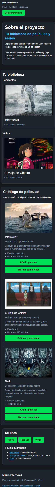
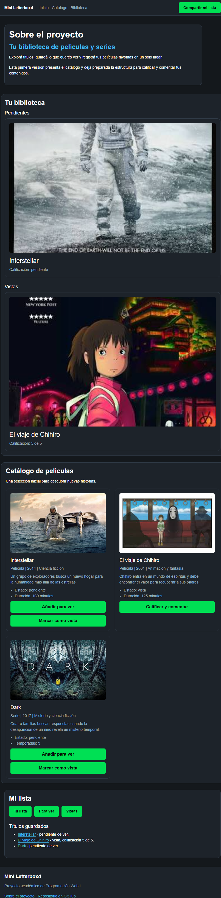
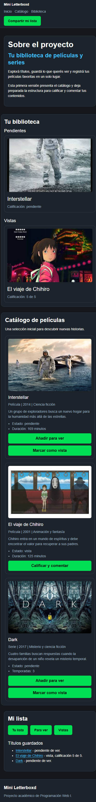

# Test Case 6 — Responsive: Migración a Bootstrap

## Metadata
| Campo | Valor |
|-------|-------|
| Responsable | Kevin Sosa |
| Fecha de ejecución | 2026-10-05 |
| Rama testeada | `feature/dev-frontend-bootstrap-migration` |
| URL testeada | `http://localhost:3000` |
| Versión de Bootstrap | 5.3.8 |

## Objetivo
Verificar que la migración a Bootstrap mantiene el comportamiento responsive del sitio,
que el sistema de columnas se aplica correctamente en todos los breakpoints definidos,
y que los estilos previos (styles.css, components.css, responsive.css) no se rompieron.

## Herramientas utilizadas
- Playwright MCP (`@playwright/mcp`) con viewport emulation
- GitHub Copilot Agent Mode

---

## Prompt para Copilot Agent Mode

Copiá este prompt en Copilot Agent Mode con Playwright MCP activo:

```text
Usando Playwright MCP, necesito testear la migración a Bootstrap de
http://localhost:3000 en distintos dispositivos y breakpoints.

Ejecutá estos pasos en orden:

1. Configurá el viewport en 390x844 (iPhone 14 Pro — Bootstrap breakpoint: xs)
   - Navegá a la página y tomá captura completa
   - Verificá si la grilla de Bootstrap apila las columnas correctamente
   - Verificá si el navbar colapsa o adapta su comportamiento
   - Verificá si hay scroll horizontal involuntario
   - Verificá si los estilos de styles.css y components.css siguen aplicados

2. Configurá el viewport en 768x1024 (iPad — Bootstrap breakpoint: md)
   - Tomá captura completa
   - Verificá si las columnas de Bootstrap cambian de layout según el breakpoint
   - Verificá coherencia visual con la version mobile

3. Configurá el viewport en 1280x800 (Desktop — Bootstrap breakpoint: lg/xl)
   - Tomá captura completa
   - Verificá si el layout de columnas coincide con el mockup actualizado
   - Verificá si bootstrap-overrides.css mantiene la identidad visual

4. Para cada breakpoint reportá:
   - Qué columnas se aplican y si el layout es correcto
   - Si algún elemento de estilos previos fue sobreescrito incorrectamente
   - Si hay diferencias visuales respecto al mockup

5. Generá un resumen indicando si la migración a Bootstrap es coherente
   en todos los breakpoints

Guardá las capturas en docs/04-testing/capturas/tc-6/
```

---

## Breakpoints testeados
| Breakpoint Bootstrap | Viewport | Layout columnas | Navbar | Scroll horizontal | Estilos previos | Estado |
|----------------------|----------|-----------------|--------|-------------------|-----------------|--------|
| xs (mobile) | 390×844 | 1 columna para cards; Library/Catalog apilados | Visible y accesible | No | Aplicados | PASS |
| md (tablet) | 768×1024 | 1 columna para cards; Library/Catalog apilados | Visible y accesible | No | Aplicados | PASS |
| lg (desktop) | 1280×800 | 3 columnas para cards; Library/Catalog lado a lado | Visible y accesible | No | Aplicados | PASS |

> Nota: la ejecución original de validación también comprobó 820×1180 (iPad Air)
> y 412×915 (Samsung Galaxy S23). En 820 px el layout Library/Catalog permanece
> apilado porque las columnas usan `col-lg-*` y el breakpoint `lg` comienza en 992 px.
> No se detectó clipping ni scroll horizontal.

## Capturas de pantalla
| Breakpoint | Captura | Estado |
|------------|---------|--------|
| xs — iPhone 14 Pro |  | PASS |
| md — iPad |  | PASS |
| lg — Desktop |  | PASS |

## Hallazgos
| # | Elemento | Breakpoint afectado | Descripción | Tipo de problema | Severidad |
|---|----------|---------------------|-------------|------------------|-----------|
| 1 | Layout Library/Catalog | 820×1180 (iPad Air) | El layout permanece apilado a 820 px porque las columnas usan `col-lg-*` y el breakpoint `lg` comienza en 992 px. No se detectó clipping ni scroll horizontal. | Observación de breakpoint | Baja |

### Severidad
- **Alta** — Rompe layout o funcionalidad
- **Media** — Problema visual significativo
- **Baja** — Detalle estético menor

## Issues creados
| Issue | Elemento | Breakpoint | Severidad | Estado |
|-------|----------|------------|-----------|--------|
| Ninguno | — | — | — | No se creó issue: la observación de 820×1180 no rompe el layout ni fue confirmada como incumplimiento del mockup |

## Conclusión general
**Resultado final:** PASS

La migración a Bootstrap es coherente y responsive en los viewports evaluados.
La grilla Bootstrap se aplica correctamente: las tarjetas se muestran en una columna
en mobile/tablet y en tres columnas en desktop; Library y Catalog se apilan en tamaños
menores al breakpoint `lg` y quedan lado a lado en desktop. No se detectó scroll
horizontal ni clipping, y los estilos existentes continúan aplicándose junto con
`bootstrap-overrides.css`.

Como observación, en 820×1180 el layout Library/Catalog continúa apilado debido al uso
de `col-lg-*`. Esto no generó un problema funcional ni visual de clipping, por lo que
se registra como observación y no como issue.

La ausencia de componentes avanzados como Navbar/Carousel no se registra como hallazgo
de este test, ya que su implementación corresponde al rol de Especialista en
Componentes Bootstrap y será evaluada mediante los Test Case 7 y 8.