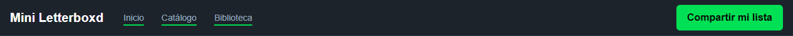
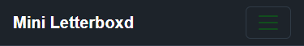
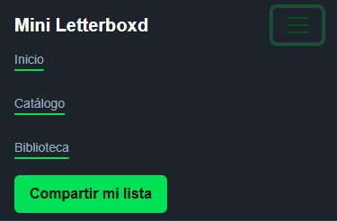
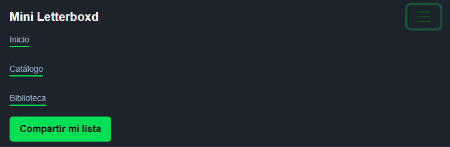

# Test Case 7 — Componente Bootstrap 1

## Metadata
| Campo | Valor |
|-------|-------|
| Responsable | Kevin Sosa |
| Fecha de ejecución | 2026-10-05 |
| Rama testeada | `feature/esp-componentes-bootstrap-add-components` |
| URL testeada | `http://localhost:3000` |

## Componente testeado

| Campo | Descripción |
|-------|-------------|
| **Nombre del componente** | Navbar |
| **Selector / ID en el HTML** | `#main-navbar` (collapse: `#main-navbar-collapse`) |
| **Sección de la página** | Encabezado / navegación principal |
| **Comportamiento esperado** | Navbar responsive con collapse en tamaños menores al breakpoint correspondiente. |

---

## Objetivo
Verificar que el componente Bootstrap implementado funciona correctamente,
responde a las interacciones del usuario, se adapta a distintos viewports
y mantiene la identidad visual definida en bootstrap-overrides.css.

## Herramientas utilizadas
- Playwright MCP (`@playwright/mcp`) con viewport emulation e interacción de UI
- GitHub Copilot Agent Mode
- GitHub MCP (`@modelcontextprotocol/server-github`) para registrar issues

---

## Prompt para Copilot Agent Mode

> **Antes de copiar el prompt:** reemplazá `[COMPONENTE]` con el nombre del componente
> y `[SELECTOR]` con el selector CSS o ID del elemento en el HTML.

```
Usando Playwright MCP, necesito testear el componente Bootstrap Navbar
en http://localhost:3000.

Selector: #main-navbar

Ejecutá estos pasos en orden:

1. Navegá a http://localhost:3000 con viewport 1280x800 (desktop)
   - Localizá el elemento #main-navbar en la página
   - Tomá captura del componente en su estado inicial
   - Interactuá con el componente según su tipo:
     · Si es un modal: hacé click en el botón que lo abre y verificá que se abre correctamente
     · Si es un navbar/collapse: hacé click en el toggler y verificá que se despliega
     · Si es un carrusel: avanzá y retrocedé slides, verificá transiciones
     · Si es un accordion: abrí y cerrá secciones, verificá que solo una esté activa
     · Si es un dropdown: hacé click y verificá que el menú aparece correctamente
     · Si es un offcanvas: activá y cerrá, verificá overlay
   - Tomá captura del componente en estado activo/expandido
   - Verificá que los estilos de bootstrap-overrides.css se aplican

2. Cambiá el viewport a 390x844 (iPhone 14 Pro — mobile)
   - Verificá que el componente se adapta correctamente
   - Repetí la interacción y tomá capturas
   - Verificá si hay diferencias respecto al desktop

3. Cambiá el viewport a 768x1024 (iPad — tablet)
   - Verificá comportamiento intermedio
   - Tomá captura

4. Reportá para cada viewport:
   - Si el componente es visible y funcional
   - Si las animaciones/transiciones funcionan
   - Si la identidad visual se mantiene (colores, tipografías de overrides)
   - Cualquier problema visual o de comportamiento

Guardá las capturas en docs/04-testing/capturas/tc-7/
```

---

## Dispositivos testeados
| Viewport | Componente visible | Interacción funcional | Estilos override | Estado |
|----------|-------------------|----------------------|------------------|--------|
| 1280×800 (desktop) | Sí | No aplica: toggler oculto por breakpoint | Sí: superficie oscura, enlaces subrayados en verde, botón verde y tipografía del proyecto | PASS |
| 390×844 (mobile) | Sí | Sí: expandir, colapsar y transición completada | Sí: colores y tipografía del proyecto | PASS |
| 768×1024 (tablet) | Sí | Sí: expandir y transición completada | Sí: colores y tipografía del proyecto | PASS |

## Capturas de pantalla
| Viewport / Estado | Captura | Estado |
|-------------------|---------|--------|
| Desktop — estado inicial |  | Generada; Navbar visible, toggler oculto |
| Desktop — estado activo | No aplica: el toggler está oculto en desktop | No se generó captura; no hay estado expandido disponible |
| Mobile — estado inicial |  | Generada; collapse cerrado |
| Mobile — estado activo |  | Generada; collapse abierto y enlaces visibles |
| Tablet |  | Generada; collapse abierto y enlaces visibles |

## Hallazgos
| # | Viewport | Descripción del problema | Comportamiento esperado | Comportamiento observado | Severidad |
|---|----------|--------------------------|-------------------------|--------------------------|-----------|
| 1 | Carga de página (todos los viewports) | Recurso `/favicon.ico` no encontrado; no afecta el Navbar | No debería haber una solicitud de recurso de favicon con respuesta 404 | La consola registró HTTP 404 para `http://localhost:3000/favicon.ico`; el Navbar siguió funcionando | Baja |

### Severidad
- **Alta** — Componente no funciona o no se renderiza
- **Media** — Problema visual o de interacción significativo
- **Baja** — Detalle estético menor

## Issues creados
| Issue | Viewport | Descripción | Severidad | Estado |
|-------|----------|-------------|-----------|--------|
| No creado | Todos | 404 de favicon, ajeno al Navbar y de baja severidad | Baja | No se creó Issue |

## Conclusión general
**Resultado final:** PASS CON OBSERVACIONES

El Navbar fue visible y responsive en los tres viewports. En desktop el toggler permaneció oculto según el breakpoint; en mobile y tablet el collapse se expandió y se observó la transición de altura. En mobile también se comprobó el cierre. Los enlaces existentes, los overrides visuales y la ausencia de overflow horizontal se verificaron correctamente. Se observó un 404 de `/favicon.ico`, ajeno al Navbar; no se creó un Issue.