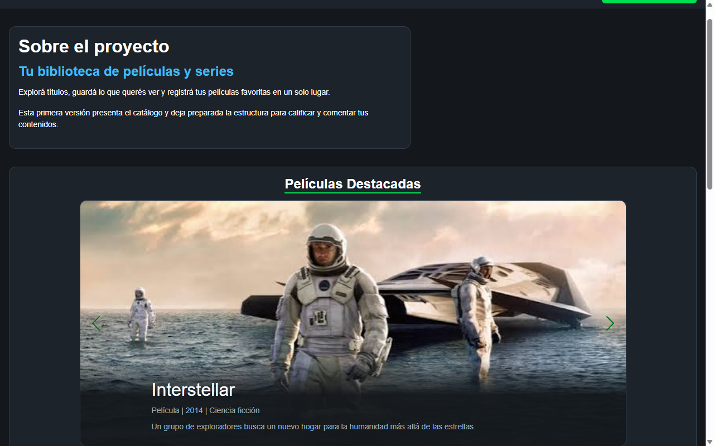
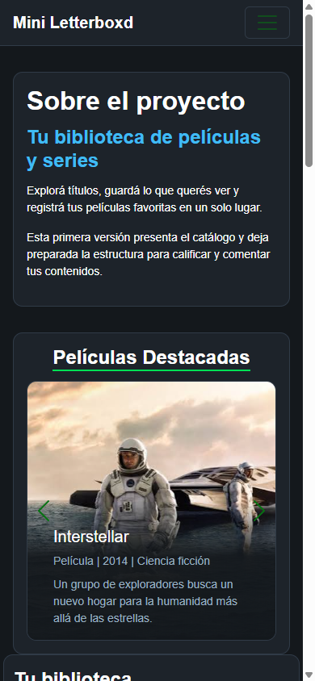
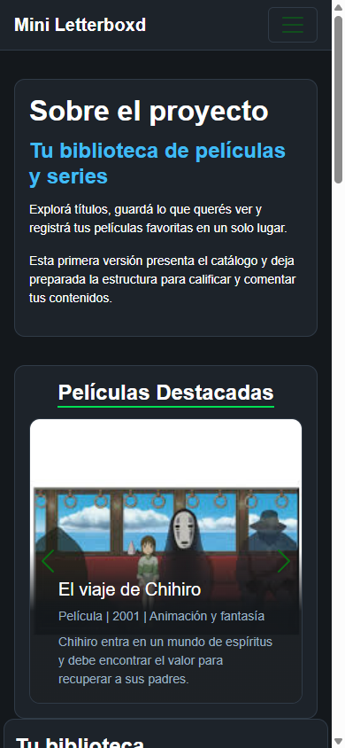
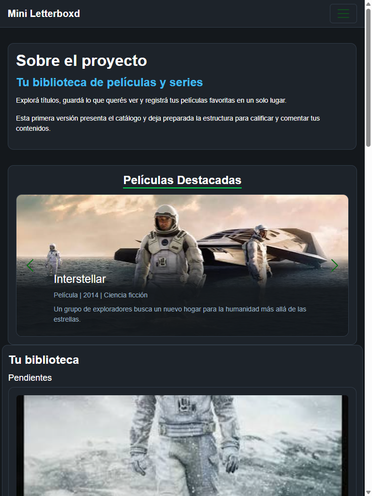

# Test Case 8 — Componente Bootstrap 2

## Metadata
| Campo | Valor |
|-------|-------|
| Responsable | Kevin Ezequiel Sosa|
| Fecha de ejecución | 05-10-26|
| Rama testeada | `feature/esp-componentes-bootstrap-add-components` |
| URL testeada | `http://localhost:3000` |

## Componente testeado

| Campo | Descripción |
|-------|-------------|
| **Nombre del componente** | Carousel |
| **Selector / ID en el HTML** | PENDIENTE — completar después de la implementación |
| **Sección de la página** | Películas destacadas |
| **Comportamiento esperado** | Carousel responsive para mostrar y navegar entre películas destacadas |

---

## Objetivo
Verificar que el segundo componente Bootstrap implementado funciona correctamente,
responde a las interacciones del usuario, se adapta a distintos viewports
y mantiene la identidad visual definida en bootstrap-overrides.css.

## Herramientas utilizadas
- Playwright MCP (`@playwright/mcp`) con viewport emulation e interacción de UI
- GitHub Copilot Agent Mode
- GitHub MCP (`@modelcontextprotocol/server-github`) para registrar issues

---

## Prompt para Copilot Agent Mode

> **Antes de copiar el prompt:** reemplazá `[COMPONENTE]` con el nombre del componente
> y `[SELECTOR]` con el selector CSS o ID del elemento en el HTML.

```
Usando Playwright MCP, necesito testear el componente Bootstrap [COMPONENTE]
en http://localhost:3000.

Ejecutá estos pasos en orden:

1. Navegá a http://localhost:3000 con viewport 1280x800 (desktop)
   - Localizá el elemento [SELECTOR] en la página
   - Tomá captura del componente en su estado inicial
   - Interactuá con el componente según su tipo:
     · Si es un modal: hacé click en el botón que lo abre y verificá que se abre correctamente
     · Si es un navbar/collapse: hacé click en el toggler y verificá que se despliega
     · Si es un carrusel: avanzá y retrocedé slides, verificá transiciones
     · Si es un accordion: abrí y cerrá secciones, verificá que solo una esté activa
     · Si es un dropdown: hacé click y verificá que el menú aparece correctamente
     · Si es un offcanvas: activá y cerrá, verificá overlay
   - Tomá captura del componente en estado activo/expandido
   - Verificá que los estilos de bootstrap-overrides.css se aplican

2. Cambiá el viewport a 390x844 (iPhone 14 Pro — mobile)
   - Verificá que el componente se adapta correctamente
   - Repetí la interacción y tomá capturas
   - Verificá si hay diferencias respecto al desktop

3. Cambiá el viewport a 768x1024 (iPad — tablet)
   - Verificá comportamiento intermedio
   - Tomá captura

4. Reportá para cada viewport:
   - Si el componente es visible y funcional
   - Si las animaciones/transiciones funcionan
   - Si la identidad visual se mantiene (colores, tipografías de overrides)
   - Cualquier problema visual o de comportamiento

Guardá las capturas en docs/04-testing/capturas/tc-8/
```

---

## Dispositivos testeados
| Viewport | Componente visible | Interacción funcional | Estilos override | Estado |
|----------|-------------------|----------------------|------------------|--------|
| 1280×800 (desktop) | | | | |
| 390×844 (mobile) | | | | |
| 768×1024 (tablet) | | | | |

## Capturas de pantalla
| Viewport / Estado | Captura | Estado |
|-------------------|---------|--------|
| Desktop — estado inicial |  | |
| Desktop — estado activo |  | |
| Mobile — estado inicial |  | |
| Mobile — estado activo |  | |
| Tablet |  | |

## Hallazgos
| # | Viewport | Descripción del problema | Comportamiento esperado | Comportamiento observado | Severidad |
|---|----------|--------------------------|-------------------------|--------------------------|-----------|
| | | | | | |

### Severidad
- **Alta** — Componente no funciona o no se renderiza
- **Media** — Problema visual o de interacción significativo
- **Baja** — Detalle estético menor

## Issues creados
| Issue | Viewport | Descripción | Severidad | Estado |
|-------|----------|-------------|-----------|--------|
| | | | | |

## Conclusión general
**Resultado final:** <!-- PASS / FAIL CON OBSERVACIONES / FAIL -->

<!-- Resumí si el componente Bootstrap funciona correctamente en todos los viewports, si los overrides se aplican y qué acciones se requieren -->